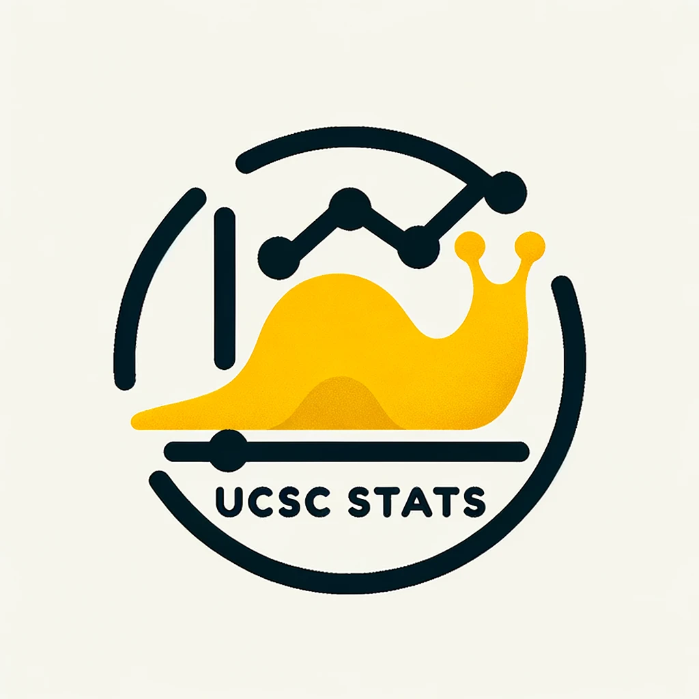

# Welcome to the TA Wiki Git Workshop

<p align="center">
  
</p>

This is a safe practice sandbox for students preparing to maintain the TA Resources wiki at https://github.com/UCSC-Statistics/TA-resources/wiki. It is an introduction to Git for wiki contributions. In one hour, you will make a small docs change and open a pull request (PR) using Git (CLI) and VS Code.

This repo is for practice only. Your PRs are reviewed here before you contribute to the real wiki.

## Start here (before the workshop)
- Complete `workshop/quickstart.md` so Git, VS Code, and authentication are ready.

## What you will do in 60 minutes
- [ ] Fork the repo on GitHub.
- [ ] Clone the repo to your laptop.
- [ ] Create a branch for your change.
- [ ] Edit a Markdown file in VS Code.
- [ ] Stage and commit the change with a clear message.
- [ ] Push your branch and open a PR on GitHub.
- [ ] Preview Markdown and check any links you touch.

End state: one PR open on GitHub and ready for review.

## Workshop materials
- `workshop/quickstart.md`
- `workshop/lab.md`
- `workshop/troubleshooting.md`

## Workshop flow (what we will use)
- Fork the repo on GitHub.
- Follow `workshop/lab.md` for the exact commands.
- Make your edits in `docs/ta-essentials.md`.
- Use `workshop/troubleshooting.md` if you get stuck.

## Fork workflow (used here)
Forks are the standard approach for public repos when contributors do not have write access. Direct pushes are common for small internal teams with shared access. In this workshop, we use forks.

Same steps:
- Edit files, `git add`, `git commit`, `git push`, open a PR.

Key differences:
- You create a personal copy (a fork) of the repo on GitHub.
- You push to your fork, not the original repo.
- Your PR goes from your fork back to `AntonioAPDL/ta-wiki-sandbox`.

## Pre-work checklist
- [ ] Git is installed (`git --version` works).
- [ ] GitHub account is ready and you can log in.
- [ ] VS Code is installed.
- [ ] You can access the repo and see the "Fork" button on GitHub.

## Git mental model (one minute)
Git keeps three layers of state. You move changes forward one step at a time so you can review what you are about to share.

```
Working tree (your files)
  | git add
Staging area (what will be committed)
  | git commit
Local history (on your laptop)
  | git push
Remote branch on GitHub
  | open PR
Pull request (review + merge)
```

Branch = an isolated line of work. A PR is the reviewable bundle of that work.

## Standard workflow (fork path used here)
Replace `<your-username>` and `<branch>` with your values.

1) Fork the repo on GitHub.
2) `git clone https://github.com/<your-username>/ta-wiki-sandbox.git` (then `cd ta-wiki-sandbox`)
3) `git checkout -b <branch>`
4) Edit files in VS Code
5) `git status`
6) `git add ...`
7) `git commit -m "docs: ..."`
8) `git push -u origin <branch>`
9) Open a PR from your fork to `AntonioAPDL/ta-wiki-sandbox`

## Hygiene for a strong PR
- Keep the change single purpose.
- Use a clear, scoped commit message.
- Preview Markdown before you push.
- Check any links you touch.
